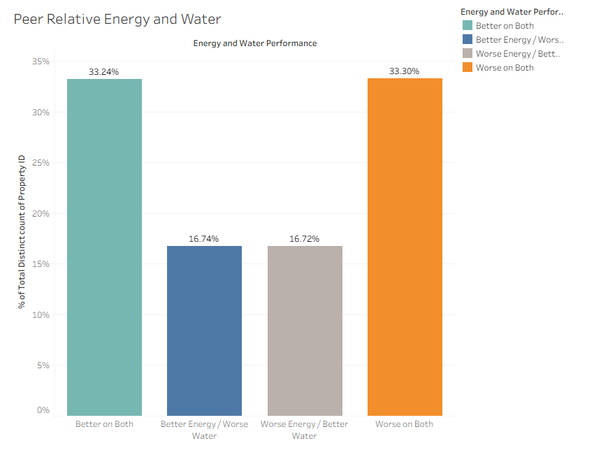

# NYC Building Energy and Water Efficiency Analysis
Analysis of 2024 NYC Local Law 84 benchmarking data using Python and Tableau to examine building energy and water performance and develop a peer-relative framework for identifying properties that may warrant further efficiency investigation.

## Project Links
[View Interactive Tableau Story](https://public.tableau.com/app/profile/lauren.berg8826/viz/LBerg_NYC_Energy_Water_Building_Analysis/Presentation?publish=yes)

[View Python Analysis Notebook](notebooks/NYC_Building_Energy_Water_Analysis.ipynb)

## Project Overview

This project analyzes 2024 NYC building energy and water benchmarking data reported under Local Law 84. The analysis explores how building characteristics relate to energy and water performance and develops a peer-relative benchmarking framework for identifying properties that may warrant further efficiency investigation.

The project combines Python-based exploratory analysis with an interactive Tableau Story.

## Research Question

What factors help explain differences in building energy and water performance, and how can peer-relative performance be used to identify buildings that may warrant further efficiency investigation?

## Key Visualization

Approximately 66.5% of properties showed aligned energy and water performance, while about 33.5% showed mixed performance. This distinction supports different approaches to prioritizing further efficiency investigation.

## Key Findings

- **Property type matters:** Energy and water intensity vary substantially across building uses, making property type an important context for evaluating performance.
- **Building size and age explain little of the overall variation in Site EUI:** Both showed very weak linear relationships with energy intensity.
- **Electricity share showed the clearest observed relationship with Site EUI:** Buildings with a higher share of electricity generally had lower Site EUI.
- **Peer-relative benchmarking provides a more useful comparison:** Buildings were evaluated relative to others of the same property type rather than against the entire building population.
- **Energy and water performance are related but not identical:** Approximately 66.5% of properties showed aligned energy and water performance, while approximately 33.5% performed better on one resource and worse on the other.

## Peer-Relative Benchmarking Approach

Buildings were ranked by Site EUI relative to other buildings of the same property type.

- **High Performers:** Lowest 25% of Site EUI within their property type
- **Typical Performers:** Middle 50%
- **Low Performers:** Highest 25%

Energy and water peer percentiles were then combined to identify four performance groups:

- Better on Both
- Better Energy / Worse Water
- Worse Energy / Better Water
- Worse on Both

This framework was used to identify properties that may warrant comprehensive or resource-specific investigation.

## Recommendations

- Use property-type peer benchmarking as an initial screening tool for building performance.
- Prioritize buildings performing poorly on both energy and water for more comprehensive investigation.
- Treat mixed performers as candidates for resource-specific investigation.
- Use buildings performing well on both resources as potential peer benchmarks.
- Conduct additional building-level investigation before recommending specific efficiency measures.

## Data

This project uses the NYC Building Energy and Water Data Disclosure for Local Law 84 dataset from NYC Open Data, with the analysis focused on calendar year 2024.

The raw dataset is not included in this repository due to file size. It can be downloaded from [NYC Open Data](https://data.cityofnewyork.us/Environment/NYC-Building-Energy-and-Water-Data-Disclosure-for-/5zyy-y8am/about_data).

Key analytical filters and data-cleaning decisions are documented in [data/README.md](data/README.md).

## Tools

- Python
- Pandas
- NumPy
- Matplotlib
- Seaborn
- Tableau

## Limitations

This analysis is intended as a screening and benchmarking framework. Peer-relative performance can identify unusual buildings but does not diagnose the cause of poor performance or determine which efficiency measures should be implemented.

The analysis is based on 2024 benchmarking data and does not evaluate performance changes over time.

## Running the Analysis

The raw dataset is not included in this repository due to file size.

To reproduce the analysis:

1. Download the NYC Building Energy and Water Data Disclosure for Local Law 84 dataset from NYC Open Data.
2. Rename the downloaded CSV to `nyc_building_energy_water.csv`.
3. Place the CSV in the `data/` folder.
4. Open `notebooks/NYC_Building_Energy_Water_Analysis.ipynb`.
5. Run the notebook from the beginning.
